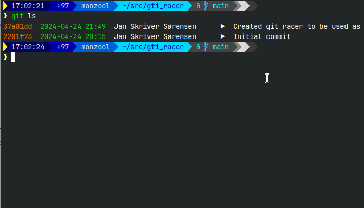

# gti_racer

Very often, instead of writing `git`, I find myself typing `gti`. This is very annoying, but instead of making `alias gti=git` I made it even more annoying!

I now use this script as `gti` alias 🤦‍♂️




## Installation

Copy *git_racer.sh* to somewhere and make it executable

```sh
chmod +x /path/to/git_racer.sh
```

Add an alias in your .bashrc/.zshrz/.profile or similar

```sh
alias gti=/path/to/git_racer.sh
```

## Usage

```sh
gti
```
